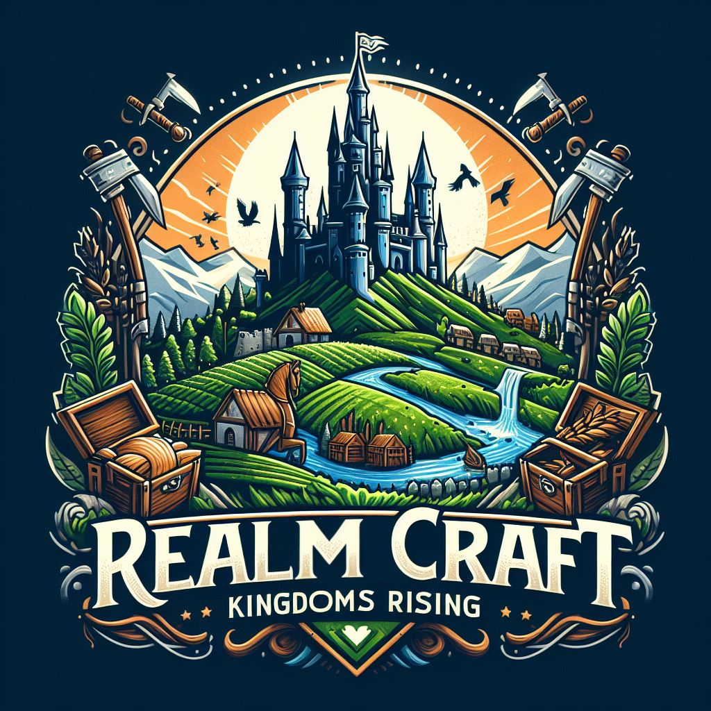

# Crafting Kingdoms



Welcome to the official repository of Crafting Kingdoms, an idle Web3 browser game set in a rich medieval world. Here you can build towns, manage your empire, and battle for glory!

## Overview
Crafting Kingdoms is a Web3 medieval game where players build towns, manage realms, and conquer dungeons.

## Table of Contents

- [Introduction](#introduction)
- [Game Features](#game-features)
- [Technologies](#technologies)
- [Setup and Installation](#setup-and-installation)
- [Environment Variables](#environment-variables)
- [Security Notes](#security-notes)
- [Deployment](#deployment)
- [Contributing](#contributing)
- [License](#license)

## Introduction

**Crafting Kingdoms** offers players a unique blend of strategic planning and RPG adventures, all integrated with blockchain technology for a secure, immersive gaming experience. Build your towns, upgrade workshops, hire workforce, and assemble armies to explore dungeons or wage wars against other realms.

## Game Features

- **Build and Manage Towns**: Start from a humble village and expand into a sprawling kingdom.
- **Workshop Management**: Upgrade and manage workshops to boost your town's productivity.
- **Hire and Train Workers**: Employ skilled workers and warriors to grow your economy and fortify your defenses.
- **Explore Dungeons**: Send expeditions to explore mysterious dungeons and uncover hidden treasures.
- **Real-time Battles**: Engage in real-time combat with other players to test your strategic skills.
- **Blockchain Integration**: Experience true ownership of in-game assets, secure transactions, and a vibrant player economy.

## Technologies

Crafting Kingdoms is built using modern web technologies:

- **Next.js** for robust server-side rendering and static generation.
- **ThirdWeb API** for seamless Web3 integrations.
- **TypeScript** for type-safe code and scalability.
- **Modular CSS** for responsive and maintainable styles.

## 🚀 Project Setup and Running the Application

### Prerequisites

#### Software Requirements
- **Node.js**: Version 18.0.0 or later
  - Download: [Node.js Official Website](https://nodejs.org/)
  - Verify installation:
    ```bash
    node --version
    npm --version
    ```

- **Git**: Latest version
  - Download: [Git Official Website](https://git-scm.com/)
  - Verify installation:
    ```bash
    git --version
    ```

#### Web3 Requirements
- **Wallet**: MetaMask (Recommended)
  - Download: [MetaMask Browser Extension](https://metamask.io/download.html)

### Step-by-Step Installation

1. Clone the Repository
```bash
git clone https://github.com/TechVantageOrg/crafting-kingdom.git
cd crafting-kingdom
```

2. Install Dependencies
```bash
npm install
```

3. Configure Environment Variables
- Copy the example environment file
```bash
cp .env.example .env
```
- Open `.env` and fill in ALL required variables:
  - ThirdWeb Client ID
  - Wallet Private Key
  - API Secrets
  - Database Connection URL

### Required Environment Variables

#### ThirdWeb Configuration
- `NEXT_PUBLIC_TEMPLATE_CLIENT_ID`: Your ThirdWeb client ID
- `THIRDWEB_API_SECRET_KEY`: ThirdWeb API secret key

#### Wallet Configuration
- `ADMIN_WALLET_ADDRESS`: Ethereum wallet address for admin operations
- `ADMIN_WALLET_PRIVATE_KEY`: Private key for the admin wallet (KEEP SECURE!)

#### Application Settings
- `DOMAIN`: Your application's primary domain (e.g., `http://localhost:3000`)
- `FACTORY_ADDRESS`: Smart contract factory address
- `ENCRYPTION_PASSWORD`: Strong, unique encryption password

#### ThirdWeb Engine (Optional)
- `THIRDWEB_ENGINE_URL`: ThirdWeb Engine URL
- `THIRDWEB_ENGINE_ACCESSTOKEN`: Access token for ThirdWeb Engine
- `THIRDWEB_ENGINE_WALLET`: Wallet address for ThirdWeb Engine

#### Database Configuration
- `POSTGRES_CONNECTION_URL`: PostgreSQL database connection string

### Running the Application

#### Development Mode
```bash
npm run dev
```
- Opens application at `http://localhost:3000`

#### Production Build
```bash
npm run build
npm start
```

### Troubleshooting

#### Common Issues
- Ensure all environment variables are correctly set
- Check Node.js and npm versions
- Verify wallet configuration
- Confirm database connection

#### Dependency Conflicts
If you encounter dependency issues:
```bash
npm install --legacy-peer-deps
```

### Security Recommendations
- Never commit `.env` file to version control
- Use strong, unique passwords
- Rotate wallet and API keys regularly
- Consider using a secrets management service

## Security Notes
- Never commit sensitive information to version control
- Use environment-specific configurations
- Rotate keys regularly

## Deployment
- Ensure all environment variables are properly set
- Use secure key management practices
- Consider using a secrets management service

## Contributing
1. Fork the repository
2. Create a feature branch
3. Commit changes
4. Push and create a Pull Request

## License
Distributed under the MIT License. See `LICENSE.md` for more information.

## Contact
Project Link: [https://github.com/TechVantageOrg/crafting-kingdom](https://github.com/TechVantageOrg/crafting-kingdom)

<br />

---
### Craft your kingdom, command your armies, and conquer the realm!
